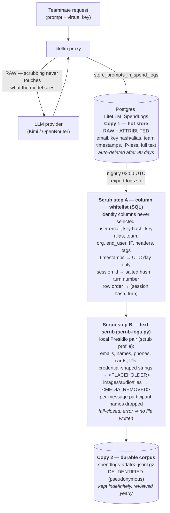

# Request Logging — Privacy Data Flow

What gets logged, where each copy lives, when de-identification happens, and why the result
is *pseudonymous* rather than *anonymous*. Companion to
[`2026-07-22-request-logging-design.md`](./2026-07-22-request-logging-design.md) (capture
design) and [`2026-07-23-request-logging-handoff.md`](./2026-07-23-request-logging-handoff.md)
(security-review status).

## The flow

Two scrub steps, one moment: **export time** — the boundary where data stops being a 90-day
operational record and becomes a permanent corpus file. Nothing is scrubbed at capture time,
on purpose:

- The **model must see the raw prompt** (scrubbed prompts would break the tool for users).
- The **hot store must stay attributed** — it's how admins debug, track spend per person, and
  honor GDPR erasure requests ("delete my rows" is only answerable while rows say whose they are).
- Scrubbing is **irreversible**, so doing it at the last moment keeps a 90-day undo window:
  if the scrubber misbehaves (e.g. a false-positive storm mangles code), fix it and re-run
  `export-logs.sh <date>` for any day still in Postgres. After 90 days the raw copy is gone
  everywhere.

## The three copies at a glance

| Copy | Content | Identity | Lifetime | Access |
|---|---|---|---|---|
| In-flight request | raw prompt/response | key auth only | seconds | provider (their ToS apply) |
| Postgres hot store | raw prompt/response | **full**: email, key hash/alias, team, timestamps | 90 days, auto-pruned | `/ui` admin login or shell on the box |
| JSONL corpus | scrubbed prompt/response | **none exported** | indefinite, yearly review (next 2027-07) | shell on the box |

## What the whitelist keeps vs. drops

Kept (corpus payload + non-identifying context): `request_id` (random UUID), `call_type`,
`model`, `model_group`, `custom_llm_provider`, `spend`, `prompt_tokens`, `completion_tokens`,
`total_tokens`, `request_duration_ms`, `cache_hit`, `status`, `mcp_namespaced_tool_name`,
`day` (date only), `session` + `turn` (see below), `messages`, `response`.

Dropped (never selected — a new LiteLLM column stays out until consciously added):
`user` (= teammate email), `api_key` (key hash), `metadata` (contains key alias + user ids),
`team_id`, `organization_id`, `end_user`, `session_id` (pseudonymized as `session`, below),
`requester_ip_address`, `request_tags`, `proxy_server_request` (raw headers), `cache_key`,
`api_base`, `agent_id`, `startTime`/`endTime`/`completionStartTime` (fine-grained timing
correlates with calendars and commit logs; the day survives as `day`).

**Session structure (training requirement, added 2026-08-04):** the corpus must let training
reconstruct whole conversations, so session grouping is exported — pseudonymously. `session`
= `md5(secret_salt || session_id)`; `turn` = the request's rank within its session, scoped to
the export day (a midnight-spanning session restarts at turn 1 in the next day's file; the
stable `session` hash still links the halves, and chat requests re-send history anyway). The raw
`session_id` never leaves Postgres because clients choose it freely (it can embed identity,
and the same string may appear in client-side logs — a salted hash is unlinkable to either;
the salt lives only in the host `.env` and is never rotated). Rows are ordered by
`(session, turn)`: one conversation's turns sit together in order, but hash ordering across
sessions stays uncorrelated with wall-clock sequence, and nothing links two sessions of the
same person. Requests without a client-provided `litellm_session_id` get a random per-request
id from LiteLLM (NULL falls back to `request_id`), i.e. singleton sessions — they gain no
linkage at all. Note that within-session linkage adds almost no re-identification surface for
chat traffic: each request re-sends the full conversation history in `messages`, so the last
turn already contained the whole conversation.

## Why pseudonymous, not anonymous

**Anonymous** (the GDPR Recital 26 bar) means nobody — including a determined colleague with
insider knowledge — can single out whose data a record is. The scrubber cannot deliver that,
because it removes *token-shaped* identity, not *contextual* identity:

- **Free text self-identifies.** "Rewrite my standup update about the XCM refactor PR" contains
  zero scrubbable entities, yet any teammate knows exactly who wrote it. Project names, task
  context, writing style, and first-person references all narrow the author down — and in a
  team of ~20, "narrowed down" usually means "identified". This is precisely the caveat the
  security engineer raised about the Google-DLP approach; it applies to Presidio equally.
- **Detectors are probabilistic.** Presidio (like DLP) misses odd formats and non-English
  names, so some real names will survive scrubbing. (The reverse also holds: spaCy assigns
  a flat 0.85 confidence to every NER hit, so all detected person names are masked —
  including false positives on code identifiers. The guard against that is the nightly
  mask-count summary plus the 90-day re-export window, not a confidence threshold.)
- **Correlation with outside knowledge.** Even day-granular timestamps plus model choice plus
  content topic can be matched against "who was working on what that week".

Making free text genuinely anonymous would mean paraphrasing or heavily truncating it, which
destroys the training value the corpus exists for. So the honest posture — taken in
README § "Logging & privacy" — is: the corpus is **de-identified/pseudonymized** (no
attribution columns, PII masked), teammates are told a colleague could still recognize them
in their own prompts, and a per-request `"no-log": true` opt-out exists.

Under GDPR this means the corpus should still be treated as personal data (pseudonymization
is a safeguard, not an exit from the regulation) — hence the bounded attributed store, the
yearly retention review, and the outstanding DPIA + training-purpose statement tracked in the
handoff doc.

## Failure modes (why the pipeline can't silently leak)

- **Presidio down / scrub error** → `scrub-logs.py` exits non-zero → `pipefail` aborts →
  temp file never moved into place. No file is better than a raw file.
- **New LiteLLM column carrying identity** → whitelist excludes it by default.
- **Detector false-positive storm** → nightly `scrub summary:` mask counts in the cron log
  spike → fix within the 90-day re-export window.
- **Partial/corrupt export** → gzip verify + atomic move (same pattern as `backup.sh`).
